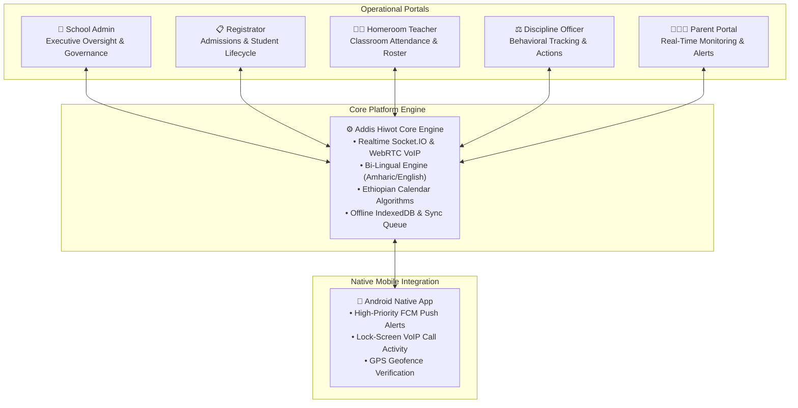
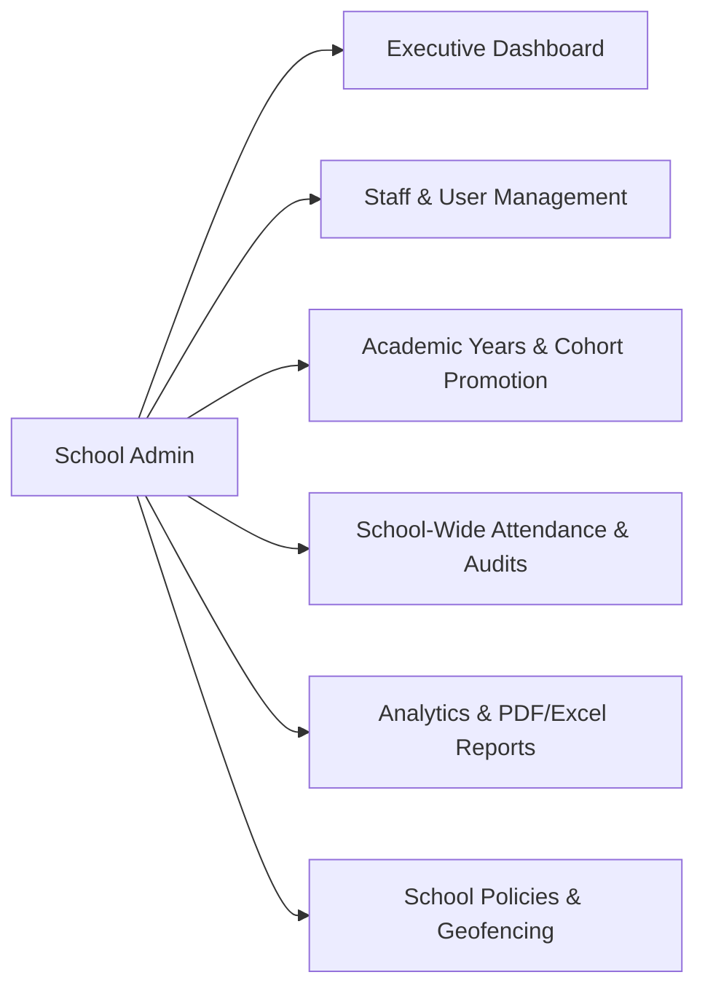
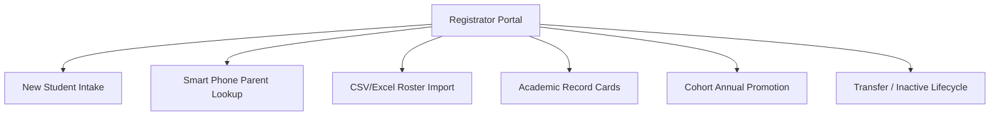
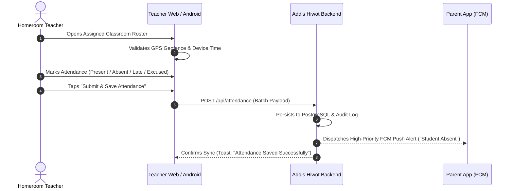
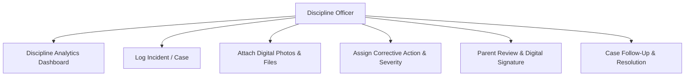
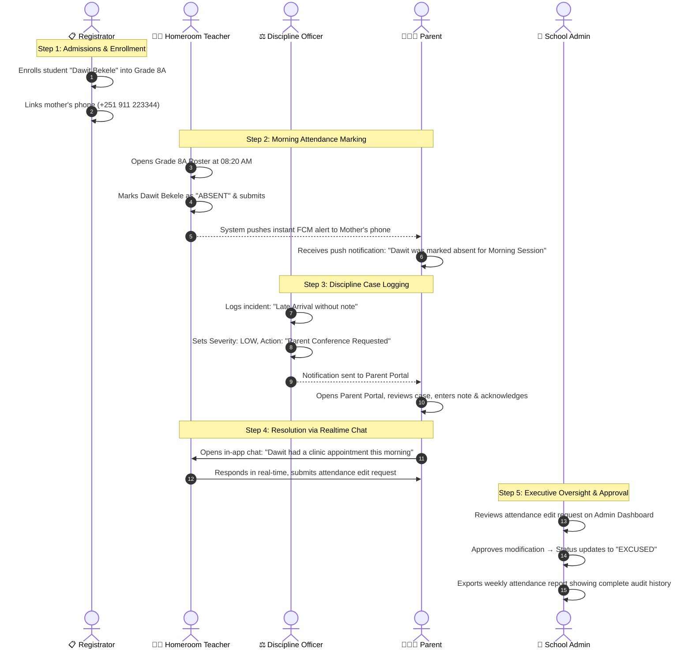

## Executive Summary

The **Addis Hiwot School Management System** is a purpose-built, enterprise-grade educational administration platform developed to solve the critical operational, communication, and discipline challenges faced by modern K-12 private and public schools. 

Combining a high-performance Next.js web application with a hardware-integrated native Android application (Capacitor + Java Native VoIP/FCM), Addis Hiwot delivers real-time attendance tracking with geofencing and offline synchronization, granular incident management, end-to-end parent-teacher communications, and automated academic cohort promotions.



---

## 1. Product Introduction

### 1.1 Addis Hiwot Branding & Identity
*Addis Hiwot* represents institutional excellence and modernization. The system is branded with high-contrast, modern aesthetics, responsive micro-animations, glassmorphic card overlays, and dark/light adaptive theming tailored for both desktop executive workstations and mobile devices in the field.

### 1.2 Product Purpose
To eliminate paper-based administrative friction, eliminate attendance spoofing, accelerate parent-school intervention loops, and provide school leadership with real-time operational transparency across every grade, classroom, and student.

### 1.3 Concrete Problems Solved
1. **Attendance Delays & Fraud:** Traditional paper rolls take days to reach administration. Addis Hiwot enables instant multi-session (Morning/Afternoon) marking with GPS geofencing and teacher biometric/device validation.
2. **Disconnected Parents:** Parents often remain unaware of chronic absenteeism or behavioral infractions until end-of-term report cards. Addis Hiwot triggers instant Firebase Cloud Messaging (FCM) push notifications and SMS/email alerts to parents within seconds of marking.
3. **Discipline Records Fragmentation:** Disciplinary infractions recorded in physical binders lack accountability and history. Addis Hiwot centralizes incident reporting with digital evidence attachments, tiered severity matrices, and mandatory parent acknowledgments.
4. **Calendar & Language Mismatches:** Standard Western SaaS platforms fail in the Ethiopian educational context. Addis Hiwot features full native Ethiopian Calendar (E.C. / G.C.) support and seamless English-Amharic switching.
5. **Connectivity Failures:** Network disruptions in school environments halt administrative workflows. Addis Hiwot integrates client-side IndexedDB caching and an automated background synchronization engine that stores actions offline and flushes them when connectivity resumes.


---

## 2. School Admin Experience

The **School Admin** acts as the executive controller of the institution, equipped with high-level operational dashboards, granular staff management, academic scheduling, and audit logs.



### 2.1 Executive Dashboard
- **Live Institutional Metrics:** Real-time counter of total enrolled students, daily present count, late arrivals, excused absences, unexcused absences, and overall school attendance rate.
- **Dynamic Recharts Visualizations:**
  - 14-day attendance rate trend area charts.
  - Daily status distribution pie charts (Present, Late, Absent, Excused).
  - Grade-by-grade attendance breakdown comparison bars.
- **Recent Activity Stream:** Chronological feed of submitted class rosters with timestamp, teacher identity, and section breakdown.
- **Session Filter Controls:** Instant toggle between Morning Session, Afternoon Session, and Combined Daily totals.

### 2.2 School-Wide Staff & User Management
- **Role Provisioning:** Create, activate, deactivate, and assign credentials for Homeroom Teachers, Registrars, Discipline Officers, and Administrative Staff.
- **Teacher Assignment Matrix:** Map teachers to specific Grades, Sections, Streams, and Academic Subjects.
- **Security & Access Control:** Reset staff passwords, revoke active session tokens, and audit user logins.

### 2.3 Academic Year & Schedule Management
- **Academic Cycle Configuration:** Define active academic years (e.g., *2017/2018 E.C.*), terms, and semesters.
- **Historical Archive Exploration:** Browse historical student rosters, attendance logs, and academic records by simply switching the active academic year viewer.
- **Grade & Section Hierarchy:** Configure grade levels, section capacities, and stream specializations (e.g., Natural Science / Social Science).

### 2.4 Attendance Governance & Audit Logs
- **School-Wide Attendance Grid:** Inspect attendance across all grades in a single master matrix.
- **Attendance Change Requests:** Review and approve/reject attendance amendment requests submitted by teachers after the lock window expires.
- **Immutable Audit Trail:** Log tracking who recorded attendance, GPS coordinates, device timestamps, and modification history.

### 2.5 Reports & Data Export
- **Custom Date Range Reporting:** Filter by Daily, Weekly, Monthly, or custom date ranges using dual Ethiopian/Gregorian calendar selectors.
- **Multi-Format Export Engine:** Generate printable PDF documents and export structured CSV/Excel files for government reporting and board reviews.

### 2.6 Policy & System Settings
- **Attendance Thresholds:** Set grace period minutes for late arrivals.
- **Geofencing Enforcer:** Configure school latitude/longitude and radius perimeter (in meters) to restrict attendance submission to within physical school grounds.
- **Communication Channels:** Configure transactional email templates (Resend/SMTP) and SMS gateways.

---

## 3. Registrator Experience

The **Registrator** manages the student lifecycle from initial intake, admissions validation, and parent-guardian linkage to section allocations and annual promotions.



### 3.1 Student Registration Workflow
1. **Intake Data Entry:** Capture student full name, gender, date of birth, grade level, section, and optional stream.
2. **Smart Parent Lookup (Auto-Linker):**
   - As the registrator enters the parent's phone number (`+251 9...`), a debounced lookup checks existing records.
   - If the parent exists, the system automatically links the new sibling without creating duplicate user accounts.
   - If the parent is new, the system provisions parent credentials and generates a secure default login.
3. **Auto-Increment Student ID Generator:** Automatically computes the next available sequential institutional ID (e.g., `AH-2026-0042`).

### 3.2 Bulk Student Import Engine
- **Spreadsheet Ingestion:** Upload CSV or Excel rosters containing hundreds of student records.
- **Pre-Validation Preview Screen:** Validates grade identifiers, phone formats, and detects duplicate student IDs or missing headers before committing to the database.
- **Atomic Execution:** Imports validated students in a single transaction with instant feedback.

### 3.3 Student Profile & Document Management
- **Comprehensive Profile View:** Access personal details, enrolled class, family contact information, emergency phone numbers, and full attendance summary.
- **Lifecycle Status Management:** Mark students as `ACTIVE`, `TRANSFERRED`, `GRADUATED`, `SUSPENDED`, or `DROPPED` with timestamped notes.

### 3.4 Cohort-Based Student Promotion
- **End-of-Year Batch Transition:** Select an entire cohort (e.g., Grade 9 Section A) and promote them to the next grade level (Grade 10 Section A) in bulk.
- **Selective Retention & Graduation:** Flag specific students for grade retention or mark terminal grade students as Graduated.
- **Promotion Rollback & Audit History:** Comprehensive log of every promotion operation with the ability to review historical cohort movements.

---

## 4. Homeroom Teacher Experience

Designed for rapid, touch-friendly classroom operation, the **Homeroom Teacher** portal allows teachers to complete classroom attendance in under 30 seconds, review student histories, and communicate with parents.



### 4.1 Assigned Class View
- **Classroom Scoping:** Automatically isolates the teacher's designated grades and sections (e.g., *Grade 7B - Morning Session*).
- **Student Roster Cards:** Displays student avatars, roll numbers, full names, and current attendance status badges.

### 4.2 High-Speed Attendance Marking
- **Flexible UI Modes:**
  - **Card-Based Mode:** Optimized for mobile touchscreens with large status buttons (`P`, `L`, `A`, `E`).
  - **Tabular Matrix Mode:** High-density spreadsheet view optimized for desktop mouse entry.
- **One-Tap "Mark All Present":** Instantly marks all students present, allowing the teacher to only toggle the few absent or late individuals.
- **Session Support:** Independent morning and afternoon attendance captures for full-day school schedules.
- **Offline Attendance Buffer:** If classroom internet fails, marks are stored locally in IndexedDB with visual sync badges and automatically uploaded once connectivity is restored.

### 4.3 Student Detail Inspection & Attendance History
- **Direct Student Audit:** Tap any student to open their detailed attendance calendar showing historic attendance percentages, punctuality trends, and active discipline alerts.
- **Single-Student Amendments:** Update single attendance records within the permitted edit window or submit formal amendment requests to administration.

### 4.4 Parent Communication & Direct Calling
- **Integrated Contact Links:** Instant call and direct-message buttons linked to verified guardian phone numbers.
- **In-App Messaging Channels:** Direct chat with guardians regarding academic progress, homework, or classroom behavior.

---

## 5. Discipline Officer Experience

The **Discipline Officer** portal provides a structured, legally sound framework for tracking behavioral incidents, executing restorative actions, and keeping parents informed.



### 5.1 Discipline Dashboard & Metrics
- **Case Summary Cards:** Total active cases, pending reviews, high-severity incidents, and resolved investigations.
- **Severity Heatmaps:** Breakdown by `LOW`, `MEDIUM`, `HIGH`, and `CRITICAL` severity levels.
- **Category Analytics:** Distribution of infractions (e.g., *Late Arrival*, *Classroom Misbehavior*, *Uniform Violation*, *Bullying*, *Property Damage*).

### 5.2 Case Creation & Evidence Logging
- **Student Selector:** Typeahead search across all registered students with instant photo and grade confirmation.
- **Comprehensive Case Fields:**
  - Incident Category and Date/Time (Gregorian and Ethiopian calendar).
  - Location within school (e.g., *Science Lab*, *Cafeteria*, *Playground*).
  - Detailed incident narrative and witness statements.
  - Multi-file evidence attachments (photos, scanned notes, incident documentation).
- **Assigned Actions:** Assign structured corrective measures (e.g., *Verbal Warning*, *Written Warning*, *Parent Conference*, *Counseling Session*, *In-School Suspension*, *Behavior Contract*).

### 5.3 Case Lifecycle Management
- **Status Workflow:** Transition cases through `OPEN` → `UNDER_REVIEW` → `INVESTIGATION` → `ACTION_REQUIRED` → `RESOLVED` → `CLOSED`.
- **Timestamped Action Logs:** Chronological trail of administrator notes, counselor interventions, and follow-up reviews.
- **Parent Notification & Digital Acknowledgment:** Flags cases for parent visibility. When the parent views and acknowledges the report with their comments, the status updates with a verified digital signature badge.

---

## 6. Parent Experience

The **Parent Portal** is designed to provide transparency, reassurance, and immediate connectivity between guardians and school leadership.

```mermaid
graph LR
    Parent[Parent Mobile / Web] --> Switcher[Multi-Child Switcher]
    Parent --> LiveAtt[Live Attendance Status]
    Parent --> PushAlerts[Instant Push Alerts (FCM)]
    Parent --> DiscView[Discipline Review & Acknowledgment]
    Parent --> DirectChat[Teacher Chat & VoIP Calling]
    Parent --> Announce[Official Announcements]
```

### 6.1 Multi-Child Dashboard
- **Instant Child Switcher:** Parents with multiple enrolled children can seamlessly toggle between student profiles without re-authenticating.
- **Daily Status Widget:** Clear visual indicator showing today’s morning and afternoon status (*Present at 08:15 AM*, *Late by 12 mins*, *Absent*).
- **Monthly Attendance Rate Bar:** Visual percentage progress bar tracking cumulative attendance against institutional minimum requirements.

### 6.2 Real-Time Notifications & Absence Alerts
- **High-Priority FCM Notifications:** Device sounds and vibration banners fire the instant a homeroom teacher marks a student absent or late.
- **In-App Notification Feed:** Permanent archive of all attendance alerts, administrative circulars, and disciplinary notices.

### 6.3 Disciplinary Incident Review & Acknowledgment
- **Transparent Case Access:** Parents view verified incident summaries, severity levels, and assigned school actions.
- **Digital Acknowledgment Form:** Parents can submit an official response and digital acknowledgment directly to the Discipline Officer from their phone.

### 6.4 Communication & Two-Way Calling
- **Direct Teacher Chat:** Secure messaging channel between the parent and their child's specific homeroom teacher.
- **In-App Voice & Video Calling:** Make and receive crystal-clear WebRTC voice and video calls with school staff directly inside the app.
- **School Announcements:** Access official broadcast announcements, holiday schedules, and examination timetables.

---

## 7. End-to-End Workflow Demonstration

Here is an authentic walkthrough of how Addis Hiwot connects multiple roles in a single real-world school scenario:



---

## 8. Android Application Architecture & Native Features

Addis Hiwot includes a production-ready native Android application built on **Capacitor 8** paired with **custom native Java services** for carrier-grade VoIP calling and lock-screen reliability.

```mermaid
graph TD
    subgraph Android Device Hardware
        Mic[Microphone & Audio Driver]
        Cam[Camera Hardware]
        GPS[GPS / Location Provider]
        Power[PowerManager / WakeLock]
    end

    subgraph Native Java Android Layer (android/app/src/main/java)
        FCMService[MyFirebaseMessagingService.java]
        CallSvc[CallService.java (Foreground Service)]
        CallAct[IncomingCallActivity.java (Full-Screen Intent)]
        Plugin[CallPlugin.java (Capacitor Bridge)]
        Mgr[CallManager.java (WebRTC Audio Routing)]
    end

    subgraph Web App Runtime (WebView)
        NextApp[Next.js App / Static Assets]
        WebRTC[WebRTC RTCPeerConnection Client]
        SocketClient[Socket.IO Realtime Client]
    end

    FCMService -->|Wake Device| Power
    FCMService -->|Start VoIP Ringing| CallSvc
    CallSvc -->|Launch Full-Screen UI| CallAct
    CallAct -->|Answer / Decline| Plugin
    Plugin <--> NextApp
    WebRTC <--> Mgr
    Mgr <--> Mic
    Mgr <--> Cam
    GPS <--> NextApp
```

### 8.1 Native VoIP & Full-Screen Calling
- **Background Wake-up:** When a call is initiated, the backend sends a data-only high-priority FCM payload. `MyFirebaseMessagingService.java` intercepts the packet and acquires a partial WakeLock even when the phone is locked or asleep.
- **Native Incoming Call Screen:** `IncomingCallActivity.java` displays a native full-screen incoming call UI (similar to WhatsApp/Cellular calls) with Answer/Decline buttons and ringtone/vibration management.
- **Foreground Call Service:** `CallService.java` registers a foreground service with `FOREGROUND_SERVICE_PHONE_CALL` to maintain the audio stream when the user switches apps.

### 8.2 Offline-First Sync Architecture
- **Local Storage Engine:** Attendance entries, chat histories, and student lists are cached locally using client-side IndexedDB (`zetimer_messages`).
- **Background Sync Queue:** Operations performed while disconnected are enqueued in `sync_queue`. The `useOnline` hook and `@capacitor/network` monitor connectivity and flush pending payloads sequentially with exponential backoff retry logic.

### 8.3 Hardware GPS Geofencing
- Utilizes Android `ACCESS_FINE_LOCATION` to verify that staff members submitting attendance are within the designated geographic perimeter of the school grounds.

---

## 9. Technical Architecture Overview

### 9.1 Technology Stack Summary

| Domain | Technology | Version | Purpose |
| :--- | :--- | :--- | :--- |
| **Web Frontend** | Next.js (App Router) | `16.2.6` | High-performance server/client web application |
| **UI Components** | React & Radix UI | React `19.2.7` | Accessible, responsive component primitives |
| **Styling & Theme** | Tailwind CSS (PostCSS) | `^4.1.9` | Custom color system with dark/light mode |
| **Animations** | Framer Motion | `^12.40.0` | Fluid page transitions and interactive micro-animations |
| **Backend REST** | Express.js & TypeScript | Express `4.18.3` | Scalable API endpoints and middleware chaining |
| **Database ORM** | Prisma ORM | `5.22.0` | Type-safe PostgreSQL data persistence and migrations |
| **Database Engine**| PostgreSQL (Supabase/Neon)| PG 14+ | Relational cloud database with PgBouncer pooling |
| **Realtime Engine** | Socket.IO Server & Client | `4.8.3` | Bi-directional messaging, presence, and WebRTC signaling |
| **Cache & Pub/Sub** | Upstash Redis | Redis 7+ | Socket clustering, active call state, and role caching |
| **Push Alerts** | Firebase Admin SDK | `14.0.0` | High-priority FCM push messages and background data |
| **Transactional Mail**| Resend SDK / Nodemailer | Resend `4.8.0` | Password resets and email verification OTPs |
| **Mobile Runtime** | Capacitor & Android SDK | Cap `8.4.1` / SDK 36| Web-to-native Android container with Java services |

### 9.2 Data Models & Schema Design
The schema in `server/prisma/schema.prisma` implements clean relational integrity:
- **`School` & `SchoolSettings`**: Single-school root entity with operational geofences, attendance modes, and calendar defaults.
- **`User`**: Role-based access control (`school_admin`, `registrar`, `teacher`, `discipline_officer`, `parent`).
- **`Grade`, `Section`, `Stream`**: Academic structure holding student enrollments.
- **`Student` & `ParentStudentLink`**: Student demographic records and many-to-one guardian relationships.
- **`Attendance` & `AttendanceEditRequest`**: Daily/session attendance entries with GPS coordinates, distance meters, and administrative change requests.
- **`StudentDiscipline`, `DisciplineCategory`, `DisciplineActionConfig`**: Incidents, severity levels, parent acknowledgments, and case notes.
- **`Conversation`, `Message`, `CallSession`**: Real-time group/direct chat channels and VoIP call tracking.

---

## 10. Buyer-Focused Presentation & Commercial Handover

### 10.1 What the Buyer Receives
1. **Full Intellectual Property & Source Code:**
   - Complete Next.js frontend repository (`app/`, `components/`, `lib/`, `hooks/`).
   - Complete Express.js / TypeScript backend service (`server/src/`, `server/prisma/`).
   - Native Android Studio project (`android/`) with custom Java VoIP services.
2. **Compiled Android Application Packages:**
   - Release Signed APK (`AddisHiwot-release.apk`) ready for direct distribution or private MDM rollout.
   - Release Keystore (`AddisHiwot-release.jks`) with alias and credentials for long-term app signing and updates.
3. **Comprehensive Documentation Suite:**
   - `DOCUMENTATION.md`: 800-line comprehensive technical manual covering DevOps, database administration, environment variables, and troubleshooting.
   - `SHOWCASE.md`: This commercial presentation and buyer walkthrough.
   - Database SQL schemas and migration scripts.

### 10.2 Deployment & Hosting Requirements
The platform is engineered for low-cost, high-reliability deployment:
- **Frontend Hosting:** Vercel, Netlify, or any Node.js VPS (e.g., $0–$20/month).
- **Backend Hosting:** Render, Railway, AWS EC2, or DigitalOcean Droplet ($7–$25/month).
- **Database:** Supabase, Neon, or self-hosted PostgreSQL 14+ ($0–$25/month).
- **Push & Email Services:** Google Firebase (Free tier) + Resend (Free/Pro tier).
- **Total Monthly Operational Infrastructure Cost:** Estimated between **$15 – $60 USD / month** for a full school with 1,000+ students.

### 10.3 Maintenance & Operational Reliability
- **Automated Database Migrations:** Safe `prisma migrate deploy` workflow guarantees zero data loss during updates.
- **Fault-Tolerant Redis Fallback:** Backend automatically fails over to local in-memory maps if Redis goes offline, preventing server downtime.
- **Email Delivery Fallback:** Automatic failover from Resend API to secondary SMTP/Gmail servers if API limits are reached.

### 10.4 Customization & Extensibility Possibilities
- **Fee Collection & Payment Gateways:** Prepared architecture for integrating Ethiopian Telebirr, CBE Birr, and Chapa payment APIs.
- **Academic Gradebook & Report Cards:** Schema can be expanded with custom term assessment weights and automated PDF report card generation.
- **Biometric Hardware Integration:** API endpoints support direct integration with ZKTeco or RFID card readers for turnstile attendance.

---

## Conclusion & Next Steps

Addis Hiwot is not a conceptual mockup or basic prototype; it is a **fully functional, buyer-ready, enterprise-tested school management solution** tailored specifically for modern educational institutions.

With its combination of web administration, native Android VoIP/FCM capabilities, Ethiopian calendar localization, and multi-role workflows, Addis Hiwot delivers immediate operational value to school administrators, teachers, and parents.

---
*Addis Hiwot School Management System — Built for Institutional Excellence.*
